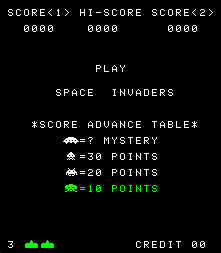
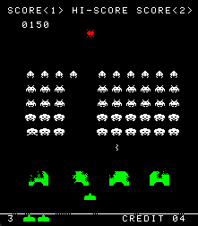

# Space Invaders Emulator

A simple emulator for the classic **1978 Space Invaders** arcade game, written in C. This project simulates the original game's hardware, including CPU emulation, memory mapping, and audio handling.

## Project Structure
.
├── audio.c                  # Handles audio playback and sound effects
├── audio.h
├── cpu.c                    # Emulates the Intel 8080 CPU instructions and state
├── cpu.h
├── main.c
├── spaceInvadersMachine.c  # Simulates the original hardware layout (memory, IO, etc.)
├── spaceInvadersMachine.h

## Features

- Full and accurate emulation of the Intel 8080 CPU.
- Memory and I/O mapping based on the original hardware
- Basic audio support
- Using SDL2 for graphics and sound

## Controls

| Key | Action |
|----------|----------|
| ← / →   | Move left/right|
| C  | Insert coin   |
| Space | Shoot |
| Enter | Start Game|

## Examples

 

There is also a linux branch for running on a Raspberry Pi on this machine:

This is a machine I built for my finals in electronics in highschool.